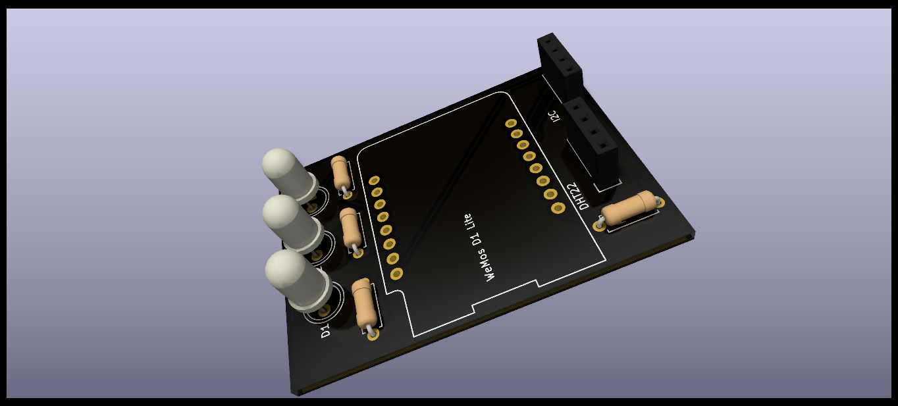
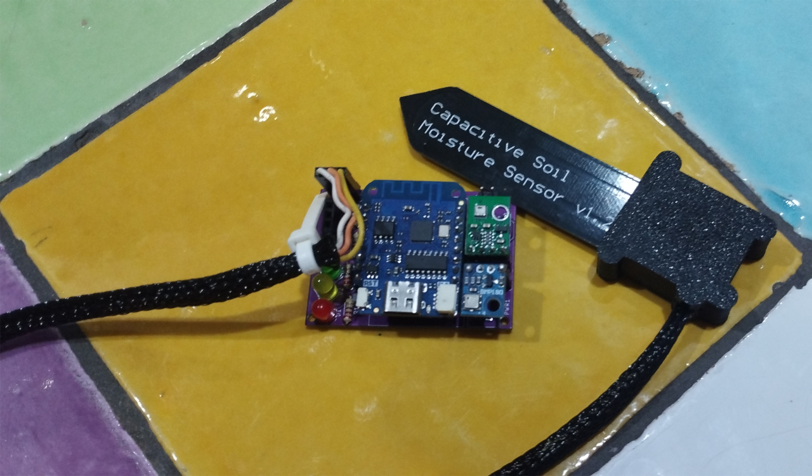
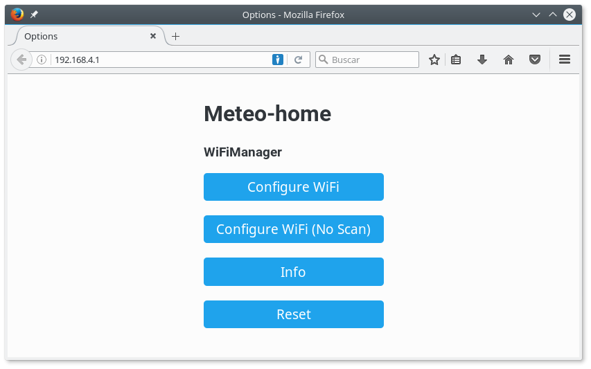
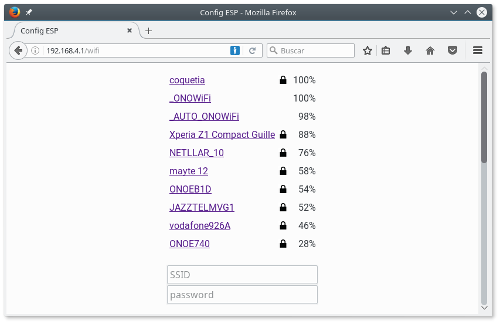
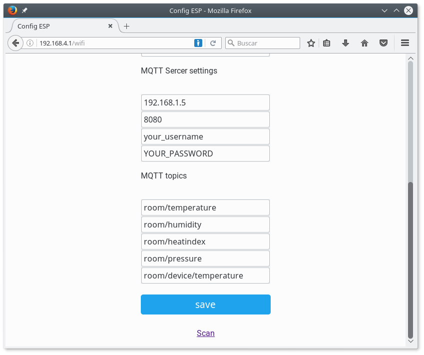
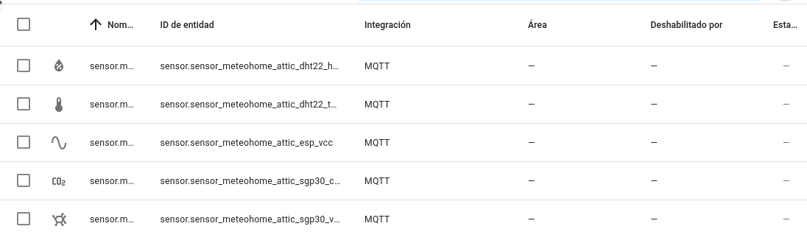

# meteo-home
MeteoHome was born as a weather station project using a NodeMCU ESP8266 devboard with DHT22 and BMP180 sensors. Now, the concept has changed and the board (currently a Wemos D1 Lite) and the source are being redesigned to allow the use of different type of sensors. One of the main features of MeteoHome is the configuration using a captive web portal and the use of MQTT to send the information to a server. Additionally, it has been designed to be connected to a machine running Home Assistant. In this case, this software could be used to show the current status of the sensors and display graphs.

## Features
- configuration of WiFi network and MQTT through a web portal 
- Deep sleep mode included for being powered by battery 
- Temperature, humidity, air pressure and air quality measurements depending on the sensors plugged to the board ( currently DHT22, BMP180, SGP30 or AHT20)
- Support for analog sensors (moisture, proximity) with configurable value mapping
- Enhanced captive portal with improved UI and grouped settings panels
- Possibility of being used with Home Assistant

### Supported Sensors
MeteoHome supports multiple sensor types that can be used simultaneously:

- DHT22: Temperature (°C) and humidity (%) measurements
- BMP180: Temperature (°C) and atmospheric pressure (Pa)
- SGP30: Air quality monitoring with CO2 (ppm) and VOC (ppb) measurements
- AHT20: High-precision temperature (°C) and humidity (%) readings
- Analog Sensors: Configurable for moisture (%) or proximity (mm) measurements through A0 pin

### LED Indicators
The board includes three status LEDs. These LEDs provide visual feedback during boot sequence and runtime operation:

During boot:

- All LEDs flash once during initial power-up
- Green LED indicates successful boot and connection

During operation with SGP30 air quality monitoring:

- Green LED: Indicates good air quality (CO2 < 600 ppm)
- Yellow LED: Indicates moderate air quality (CO2 600-800 ppm)
- Red LED: Indicates poor air quality (CO2 > 800 ppm)

## Future
The idea is to continue the development of both hardware and software. Currently the MCU is a Wemos D1 Lite but the plan is to extend the possibilities including an ESP32 or a Raspberry Pi Pico, At the same time, the software will accept more sensors and will be adapted to the new hardware.

- Integration of light sensor
- ~~Integration of ATH20 sensor~~
- Adoption of a new MCU (ESP32 or Raspberry Pi Pico)
- Hardware redesign for the new MCU
- Development of software for the new board 

## Requirements
- PlatformIO IDE (used to build, test and check quality of code)
- Additional libraries: WiFiManager, Arduino Json, PubSubClient, DHT, Adafruit BMP085 and Adafruit AHTX0 (see platformio.ini)
- A computer running MQTT
- [Optional] A computer running Home Assistant

## Building the software

To build the software PlatformIO is needed. There are two options, the first one is to use the IDE and the second, covered here, is to use the pio command:

```shell
pio run --environment d1_mini_lite
```

## Hardware

The hardware has been designed in Kicad. All the source files are available under the Kicad directory of this repository.



### Hardware components
- Wemos D1 Mini Lite (the board is designed to use this microcontroller)
- One or more sensors (DHT22, BMP180, SGP-30)
- Analog sensors (moisture, proximity sensors connected to A0 pin)
- Wires, tools...

Below the current BOM is shown. There are no sensors included, as the idea is to plug any of the supported and are not considered part of the hardware design:

|#  |Reference|Qty|Value                     |LibPart                                                     |Footprint|
|---|---------|---|--------------------------|------------------------------------------------------------|----|
|1  |A1       |1  |Analog Sensor            |Connector:Conn_01x03_Socket                                 |Connector_PinSocket_2.54mm:PinSocket_1x03_P2.54mm_Vertical|
|2  |D1       |1  |Red                      |meteo-home-rescue:LED-meteo-home-rescue-co2-detector-rescue |LED_THT:LED_D3.0mm|
|3  |D2       |1  |Yellow                   |meteo-home-rescue:LED-meteo-home-rescue-co2-detector-rescue |LED_THT:LED_D3.0mm|
|4  |D3       |1  |Green                    |meteo-home-rescue:LED-meteo-home-rescue-co2-detector-rescue |LED_THT:LED_D3.0mm|
|5  |DHT22    |1  |DHT22_Temperature_Humidity|meteo-home-rescue:DHT22_Temperature_Humidity-sensors-meteo-home-rescue-co2-detector-rescue|Sensors:DHT22_Temperature_Humidity|
|6  |I2C1     |1  |I2C 1                    |Connector:Conn_01x04_Socket                                |Connector_PinSocket_2.54mm:PinSocket_1x04_P2.54mm_Vertical|
|7  |I2C2     |1  |I2C 2                    |Connector:Conn_01x04_Socket                                |Connector_PinSocket_2.54mm:PinSocket_1x04_P2.54mm_Vertical|
|8  |I2C3     |1  |I2C 3                    |Connector:Conn_01x04_Socket                                |Connector_PinSocket_1.00mm:PinSocket_1x04_P1.00mm_Vertical|
|9  |I2C4     |1  |I2C 4                    |Connector:Conn_01x04_Socket                                |Connector_PinSocket_1.00mm:PinSocket_1x04_P1.00mm_Vertical|
|10 |J1       |1  |S 4                      |Connector:Conn_01x04_Socket                                |Connector_PinSocket_2.54mm:PinSocket_1x04_P2.54mm_Vertical|
|11 |MCU1     |1  |WeMos_D1_mini            |meteo-home-rescue:WeMos_D1_mini-wemos_mini-meteo-home-rescue-co2-detector-rescue|Module:WEMOS_D1_mini_light|
|12 |PWR1     |1  |Power connector          |Connector:Conn_01x02_Socket                                |Connector_Molex:Molex_SL_171971-0002_1x02_P2.54mm_Vertical|
|13 |R1, R2   |2  |160                      |meteo-home-rescue:R-meteo-home-rescue-co2-detector-rescue  |Resistor_THT:R_Axial_DIN0204_L3.6mm_D1.6mm_P5.08mm_Horizontal|
|14 |R3       |1  |90                       |meteo-home-rescue:R-meteo-home-rescue-co2-detector-rescue  |Resistor_THT:R_Axial_DIN0204_L3.6mm_D1.6mm_P5.08mm_Horizontal|
|15 |R4       |1  |10K                      |meteo-home-rescue:R-meteo-home-rescue-co2-detector-rescue  |Resistor_THT:R_Axial_DIN0204_L3.6mm_D1.6mm_P5.08mm_Horizontal|
|16 |Tx1      |1  |Rx                       |Connector:Conn_01x02_Socket                                |Connector_PinSocket_2.54mm:PinSocket_1x02_P2.54mm_Vertical|


 

## Configuring a meteo-home device
After uploading the sketch and the first execution the device will run as an Access Point. Check the available networks for you computer and connect with "meteo-home". After that, point your browser to http://192.168.4.1 and the captive portal will be displayed. 

> **Note:** on some Android phones, the system's captive-portal-login popup can show a stale or incomplete cached version of the page (e.g. missing the "Network settings"/"MQTT Server settings"/"Device parameters" fields on the "Configure WiFi" page). If that happens, open a regular browser (Chrome, Firefox, etc.) and navigate to http://192.168.4.1 manually instead of using the auto-launched popup.

 

Choose the first option ("Configure WiFi") and select your home WiFi network from the list of detected APs and introduce its password. 

 

Now you have to configure your network settings. Below, the fields related to your MQTT server should be introduced. Then, in the "Device parameters" section, it is required to introduce a word identifying your device (you can use a name or the location where it will be installed). This value will be used to create the topics where the data will be sent through MQTT. 

 

The device supports analog sensors connected to the A0 pin. Through the captive portal, you can:

- Enable/disable analog sensor reading
- Select sensor class (moisture or proximity)
- Configure value mapping between raw analog readings (0-1024) to percentage (0-100%)
- Set minimum and maximum thresholds for the mapping function

 

The improved captive portal now features:

- Grouped settings panels for better organization
- Dynamic show/hide of configuration options
- Real-time value preview using range sliders
- Enhanced visual styling and layout

## Remote reconfiguration

Once configured, a MeteoHome device can be reconfigured without physical access by
publishing an MQTT command. Only device/sensor parameters can be changed (not network or
MQTT credentials, which still require deleting `config.json` and going through the portal
again).

Each device has a secret 32-character token (`config_token`), generated automatically. On a
new device it is shown on the captive portal page, next to the device name. On a device
updated from a firmware version prior to this feature, the token is generated on the first
boot after the update and printed once over Serial (9600 baud) — check it before it's lost,
or delete `config.json` to go through the portal again and see it there.

To reconfigure, publish a JSON with `retain=true` to `meteohome/<device>/config/set`,
including the token and only the fields you want to change:

```shell
mosquitto_pub -h <broker> -t 'meteohome/attic/config/set' -r \
  -m '{"token":"<config_token>","sleep_minutes":10,"device_name":"attic"}'
```

Accepted fields: `device_name`, `use_sleep_mode`, `sleep_minutes` (1-60),
`use_analog_sensor`, `sensor_class`, `use_arduino_map_function`, `analog_min_value` and
`analog_max_value` (0-1024, with `analog_min_value < analog_max_value`).

The device responds on `meteohome/<device>/config/result` (not retained):

- `{"status":"applied","fields":[...]}` — change applied; the device restarts.
- `{"status":"error","reason":"invalid_token"}` — token missing or incorrect.
- `{"status":"error","reason":"invalid_payload"}` — malformed JSON.
- `{"status":"error","reason":"invalid_field:<name>"}` — a field is out of range or of the
  wrong type; no change is applied (transactional validation).

After processing the command (whether successful or not), the device clears the retained
message on `config/set` so it isn't reprocessed on the next reconnection.

In addition, on every connection to the broker the device publishes its current
configuration (without the token) as retained on `meteohome/<device>/config/state`:

```json
{
  "device_name": "attic",
  "use_sleep_mode": true,
  "sleep_minutes": 15,
  "use_analog_sensor": false,
  "sensor_class": "moisture",
  "use_arduino_map_function": true,
  "analog_min_value": 0,
  "analog_max_value": 1024
}
```

This topic makes it possible to build a form (for example, in Home Assistant) that
auto-fills with the device's real values before sending a change.

### Remote reconfiguration page

`tools/remote-config.html` is a self-contained page (HTML + JS, no backend or external
dependencies) that reads a device's state and applies changes without hand-crafting JSON.
Open it directly as a local file in your browser (double-click or `file://`).

**Prerequisite (one-time, on your broker):** enable a WebSocket listener. In Mosquitto, add
to the configuration:

```
listener 9001
protocol websockets
```

and restart the service. Without this, the page won't be able to connect.

**Usage:**
1. Open `tools/remote-config.html` in your browser.
2. Under "Broker connection", enter your broker's host and WebSocket port (the `9001` from
   the example above), and the MQTT username/password if your broker requires them. Click
   "Connect".
3. Under "Device", enter the device's `device_name` and its token, and click "Read current
   state" — the form will fill in with the device's real values.
4. Edit whichever fields you want to change and click "Apply changes". The device will
   apply the change (or return an error) and the result will appear in the "Result"
   section.

Connection details and each device's token are saved in the browser's `localStorage` where
you open the page, so you don't have to re-enter them every time — the same level of trust
you already assume by storing those same credentials elsewhere (e.g. Home Assistant). If you
expose the broker's WebSocket listener beyond your local network, do so at your own security
discretion; this page adds no extra protection on top of the existing token.

## Using MeteoHome with Home Assistant
A MeteoHome device publishes the data it collects to a MQTT broker. The topics used follow the specifications made by Home Assistant project and it is possible to use this software to store and use MeteoHome produced data. When a MeteoHome board is connected to a power source, it sends Home Assisant autodiscovery messages making it available through the MQTT integration.


 

If Home Assistant is not your preferred option, any other software that includes a MQTT broker could be used to obtain the data. To get the data, the software should be configured to subscribe to the appropriate topics. As an example the following topics are availabe if a DHT22 and SGP-30 sensors are plugged to a board configured with "attic" as topic prefix:


| Sensor  | Topic  |   |   |   |
|---|---|---|---|---|
| DHT22  | attic/DHT22/temperature  | DHT22 temperature value  |   |   |
| DHT22  | attic/DHT22/humidity  | DHT22 humidity value  |   |   |
| DHT22  | attic/DHT22/heatindex  | DHT22 heat index value  |   |   |
| SGP30  | attic/SGP30/co2  | SGP30 CO2 ppp  |   |   |
| SGP30  | attic/SGP30/voc  | SGP30 air quality |   |   |
| ESP8266  | attic/ESP/vcc  | ESP8266/microcontroller voltage   |   |   |
| Analog  | attic/moisture/value | Moisture sensor percentage |
| Analog  | attic/proximity/value | Proximity sensor value |
| AHT20 | attic/AHT20/temperature | AHT20 temperature value |
| AHT20 | attic/AHT20/humidity | AHT20 humidity value |
