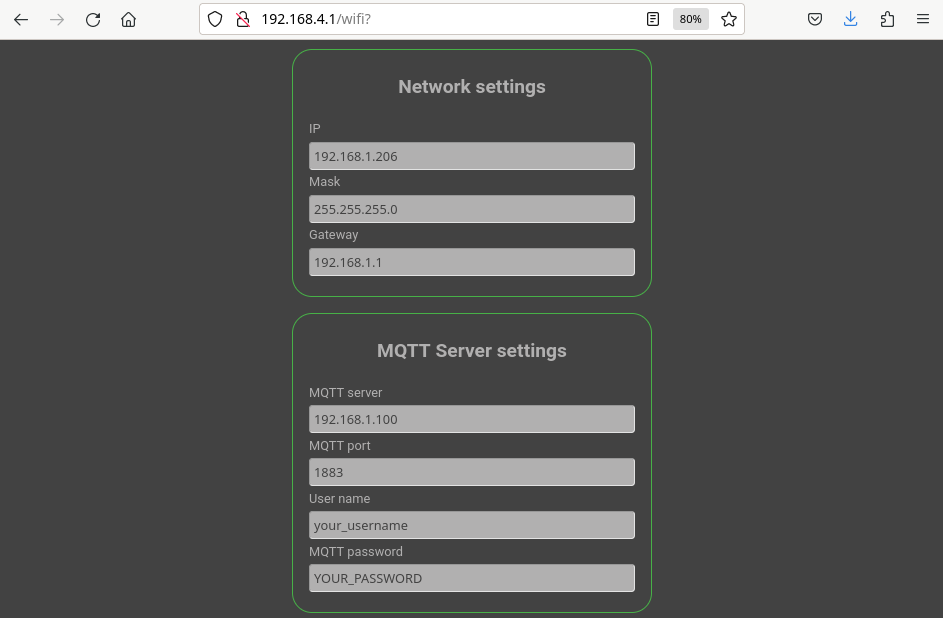

# meteo-home
MeteoHome is yet another weather station project using a NodeMCU ESP8266 devboard with DHT22 and BMPP180 sensors. The particularity in this case is the configuration using a captive web portal and the use of MQTT to send the information to a server. Additionally the machine that gathers all the data 
runs Home Assistant which is the responsible of showing the current status of the sensors and historical graphs

## Features
- configuration of WiFi network and MQTT through a web portal 
- Deep sleep mode included for being powered by battery 
- Temperature, humidity and air pressure measurements
- Possibility of being used with Home Assistant

## Requirements
- This source uses Arduino IDE and its standard libraries
- Additional libraries: WiFiManager, Arduino Json, PubSubClient, DHT and Adafruit BMP085
- A computer running MQTT
- [Optional] A computer running Home Assistant

## Hardware components
- NodeMCU 0.9/1.0
- DHT22 sensor
- BMPP180 sensor
- Wires, tools...

 

##Configuring a meteo-home device
After uploading the sketch and the first execution the device will run as an Access Point. Check the available networks for you computer and connect "with meteo-home". After that, point your browser to http://192.168.4.1 and the captive portal will be displayed. 

 

Choose the first option ("Configure WiFi") and select your home WiFi network from the list of detected APs. 

 

Write your WiFi password and fill all the fields related to your MQTT server.

 

##Using MeteoHome with Home Assistant
I use Home Assistant to collect all the data and display the information. The software runs in a miniPC (a SolidRun CuBox-i) which is a small home IoT server and also has the Mosquitto mqtt broker. The device sends the sensors data to the mqtt broker and Home Assistant reads it and stores everything in a SqLite data base. 
In addition to that Home Assistant has a frontend application that shows the current status of all your sensors and historical graphs of a selected day.

 

If you want to try it, a sample configuration [file](configuration.yaml) for Home Assistant is included in this repository. 

##Protoypes
The easiest way to try the code is to use a breadboard. The picture below is a NodeMCU 1.0 with all the wires connected as shown in the Fritzing drawing

 

After testing it in the breadboard I moved everything to a perfboard. Here you can see a NodeMCU 0.9 which in the first perfboard prototype 

 
