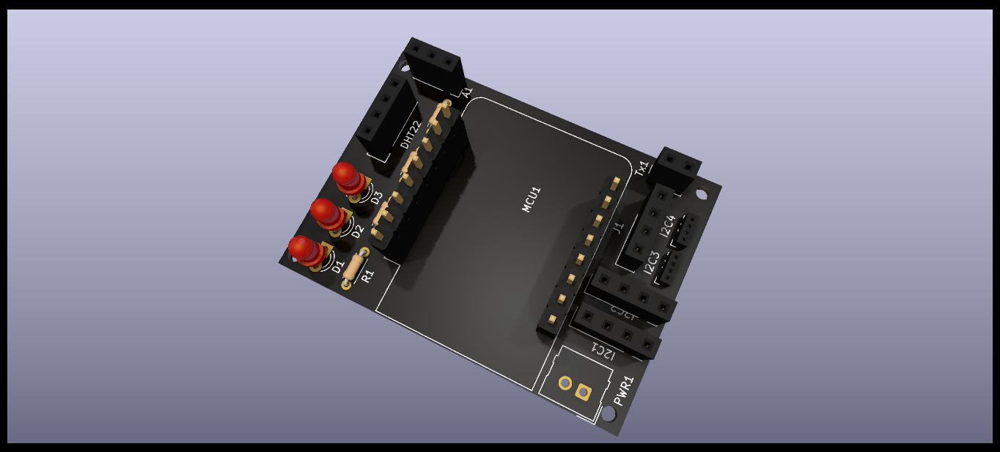

# meteo-home
MeteoHome was born as a weather station project using a NodeMCU ESP8266 devboard with DHT22 and BMPP180 sensors. Now, the concept has changed and the board (currently a Wemos D1 Lite) and the source is being redesigned to allow the use of different type of sensors. One of the main features of MeteoHome is the configuration using a captive web portal and the use of MQTT to send the information to a server. Additionally it has been designed to be connected to a machine running Home Assistant. In this case, this software could be used to show the current the status of the sensors and display graphs

## Features
- configuration of WiFi network and MQTT through a web portal 
- Deep sleep mode included for being powered by battery 
- Temperature, humidity, air pressure and air quality measurements depending on the sensors plugged to the board ( currently DHT22, BMP180 or SGP30)
- Possibility of being used with Home Assistant

## Future
The idea is to continue the development of both hardware and software. Currently the MCU is a Wemos D1 Lite but the plan is to extend the possibilites including an ESP32 or a Raspberry Pi Pico, At the same time the sofware will accept more sensors and will be adapted to the new hardware.

- Integration of light sensor
- Integration of ATH20 sensor
- Adoption of a new MCU (ESP32 or Raspberry Pi Pico)
- Hardware redesign for the new MCU
- Development of software for the new board 

## Requirements
- PlatformIO IDE (used to build, test and check quality of code)
- Additional libraries: WiFiManager, Arduino Json, PubSubClient, DHT and Adafruit BMP085 (see platformio.ini)
- A computer running MQTT
- [Optional] A computer running Home Assistant


## Building the software

To build the software PlatformIO is needed. There are two options, the first one is to use the IDE and the second, covered here, is to use the pio command:

```shell
pio run --environment d1_mini_lite
```

## Hardware

The hardware has been designed in Kicad. All the source files are available under the Kicad directory of this repository.



### Hardware components
- Wemos D1 Mini Lite (the board is designed to use that microcontroller)
- One or more sensors (DHT22, BMPP180, SGP-30)
- Wires, tools...

Below the current BOM is shown. There are no sensors included, as the idea is to plug any of the supported and are not considered part of the hardware design:

|#  |Reference|Qty|Value                     |Footprint                                                     |
|---|---------|---|--------------------------|--------------------------------------------------------------|
|1  |D1       |1  |Red                       |LEDs:LED_D5.0mm                                               |
|2  |D2       |1  |Yellow                    |LEDs:LED_D5.0mm                                               |
|3  |D3       |1  |Green                     |LEDs:LED_D5.0mm                                               |
|4  |R1, R2   |2  |160                       |Resistors_THT:R_Axial_DIN0207_L6.3mm_D2.5mm_P7.62mm_Horizontal|
|5  |R3       |1  |90                        |Resistors_THT:R_Axial_DIN0207_L6.3mm_D2.5mm_P7.62mm_Horizontal|
|6  |R4       |1  |10K                       |Resistors_THT:R_Axial_DIN0207_L6.3mm_D2.5mm_P7.62mm_Horizontal|
|8  |U1       |1  |WeMos_D1_mini             |wemos-d1-mini:wemos-d1-mini-with-pin-header                   |


 


## Configuring a meteo-home device
After uploading the sketch and the first execution the device will run as an Access Point. Check the available networks for you computer and connect with "meteo-home". After that, point your browser to http://192.168.4.1 and the captive portal will be displayed. 

 

Choose the first option ("Configure WiFi") and select your home WiFi network from the list of detected APs and introduce its password. 

 

Now you have to configure your network settings. Below, the fields related to your MQTT server should be introduced. Then, in the "Device parameters" section, it is required to introduce a word identifying your device (you can use a name or the location where it will be installed). This value will be used to create the topics where the data will be sent through MQTT. 

 

## Using MeteoHome with Home Assistant
A MeteoHome device publishes the data it collects to a MQTT broker. The topics used follow the specifications made by Home Assistant project and it is possible to use this software to store and use MeteoHome produced data. When a MeteoHome board is connected to a power source, it sends Home Assisant autodiscovery messages making it available through the MQTT integration.


 

If Home Assistant is not your prefered option, any other software that includes a MQTT broker could be used to obtain the data. To get the data, the software should be configured to subscribe to the appropriate topics. As an example the following topics are availabe if a DHT22 and SGP-30 sensors are plugged to a board configred with "attic" as topic prefix:


| Sensor  | Topic  |   |   |   |
|---|---|---|---|---|
| DHT22  | attic/DHT22/temperature  | DHT22 tenperature value  |   |   |
| DHT22  | attic/DHT22/humidity  | DHT22 humidity value  |   |   |
| DHT22  | attic/DHT22/heatindex  | DHT22 heat index value  |   |   |
| SGP30  | attic/SGP30/co2  | SGP30 CO2 ppp  |   |   |
| SGP30  | attic/SGP30/voc  | SGP30 air quality |   |   |
| ESP8266  | attic/ESP/vcc  | ESP8266/microcontroller voltage received  |   |   |
